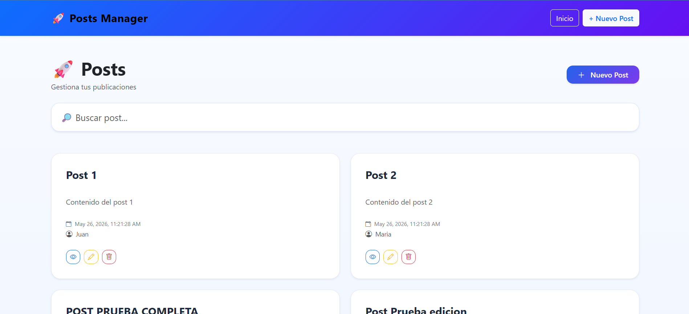
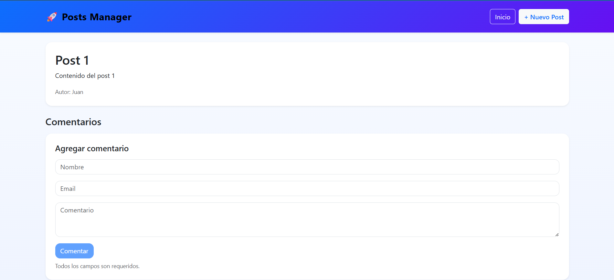
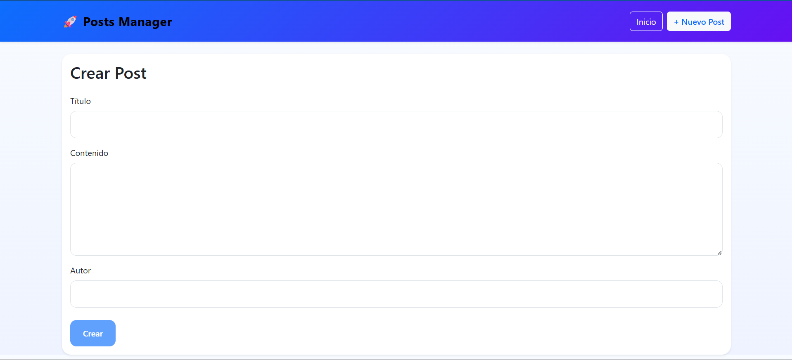
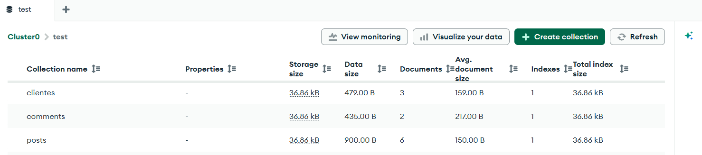

# 🚀 Posts Manager Fullstack

Aplicación fullstack para administración de posts y comentarios desarrollada con Angular 18, NestJS y MongoDB Atlas.

---

# 📌 Características

## ✅ Frontend

* Angular 18
* Angular Signals
* RxJS
* Reactive Forms
* Global Error Interceptor
* Responsive UI
* Bootstrap + Bootstrap Icons
* CRUD completo de posts
* CRUD de comentarios
* Búsqueda dinámica
* Loading states
* Detail page
* Create/Edit forms

---

## ✅ Backend

* NestJS
* MongoDB Atlas
* Mongoose
* DTO Validation
* Global Exception Filter
* Response Interceptor
* Standardized API Responses
* CRUD completo de posts
* CRUD de comentarios
* Bulk Upload Endpoint

---

# 🛠️ Tech Stack

## Frontend

* Angular 18
* TypeScript
* RxJS
* Bootstrap 5

## Backend

* NestJS
* MongoDB Atlas
* Mongoose
* TypeScript

---

# 📂 Project Structure

```bash
posts-manager-fullstack/
├── frontend/
└── backend/
```

---

# ⚙️ Backend Setup

## 1. Navigate to backend

```bash
cd backend
```

## 2. Install dependencies

```bash
npm install
```

## 3. Configure environment variables

Create a `.env` file inside `backend/`

```env
MONGO_URI=your_mongodb_uri
PORT=3000
```

## 4. Run backend

```bash
npm run start:dev
```

Backend runs on:

```bash
http://localhost:3000
```

---

# ⚙️ Frontend Setup

## 1. Navigate to frontend

```bash
cd frontend
```

## 2. Install dependencies

```bash
npm install
```

## 3. Run frontend

```bash
ng serve
```

Frontend runs on:

```bash
http://localhost:4200
```

---

# 📡 API Endpoints

## Posts

| Method | Endpoint    |
| ------ | ----------- |
| GET    | /posts      |
| GET    | /posts/:id  |
| POST   | /posts      |
| PUT    | /posts/:id  |
| DELETE | /posts/:id  |
| POST   | /posts/bulk |

---

## Comments

| Method | Endpoint            |
| ------ | ------------------- |
| GET    | /comments?postId=id |
| POST   | /comments           |
| DELETE | /comments/:id       |

---

# 📦 Bulk Upload Example

```json
[
  {
    "title": "Post 1",
    "body": "Contenido del post 1",
    "author": "Juan"
  },
  {
    "title": "Post 2",
    "body": "Contenido del post 2",
    "author": "Maria"
  }
]
```

---

# 🎨 Features Implemented

* CRUD Posts
* CRUD Comments
* Bulk Upload
* Angular Signals
* RxJS
* Reactive Forms
* Global Error Handling
* MongoDB Atlas Integration
* Modern UI/UX
* Search Filter
* Loading States

---

# 📸 Screenshots

## Home



## Detail Page



## Post Form



## MongoDB Atlas



# 👨‍💻 Author

Neftali Alexander Andrade Alegría
